# 📊 CryptoVault Enterprise - Visual Diagrams

> Mermaid diagrams for documentation and presentations
> These can be rendered in GitHub, VS Code, or exported as images

---

## 1. System Architecture

```mermaid
flowchart TB
    subgraph Client["🖥️ Client Browser"]
        A[User File] --> B[AES-256-GCM Encryption]
        B --> C[RSA-4096 Key Wrapping]
        C --> D[HMAC Generation]
    end
    
    subgraph Server["🖧 Next.js Server"]
        E[API Routes]
        F[Prisma ORM]
        G[JWT Auth]
    end
    
    subgraph Cloud["☁️ Cloud Infrastructure"]
        H[(AWS S3)]
        I[AWS KMS]
        J[(PostgreSQL)]
    end
    
    D --> E
    E --> H
    E --> I
    F --> J
    G --> E
```



---

## 2. Encryption Flow - File Upload

```mermaid
sequenceDiagram
    participant U as User
    participant B as Browser
    participant S as Server
    participant S3 as AWS S3
    participant KMS as AWS KMS

    U->>B: Select file to upload
    B->>B: Generate DEK (AES-256)
    B->>B: Generate random IV
    B->>B: Encrypt file with AES-256-GCM
    B->>B: Wrap DEK with RSA-4096
    B->>B: Generate HMAC-SHA512
    B->>S: POST /api/files/upload
    S->>KMS: Wrap DEK with KMS key
    KMS-->>S: KMS-wrapped DEK
    S->>S3: Store encrypted file
    S3-->>S: Storage confirmation
    S->>S: Save metadata to PostgreSQL
    S-->>B: Upload success response
    B-->>U: ✅ File uploaded securely
```



---

## 3. Encryption Flow - File Download

```mermaid
sequenceDiagram
    participant U as User
    participant B as Browser
    participant S as Server
    participant S3 as AWS S3
    participant KMS as AWS KMS

    U->>B: Request file download
    B->>S: GET /api/files/download?fileId=xxx
    S->>S3: Fetch encrypted file
    S3-->>S: Encrypted data
    S->>S: Get metadata from PostgreSQL
    S->>KMS: Unwrap DEK (optional)
    KMS-->>S: Unwrapped DEK
    S-->>B: Encrypted data + crypto params
    B->>B: Verify HMAC signature
    B->>B: Unwrap DEK with RSA private key
    B->>B: Decrypt with AES-256-GCM
    B->>B: Verify auth tag
    B-->>U: ✅ Original file
```



---

## 4. Envelope Encryption Pattern


---

## 5. 7 Security Layers


---

## 6. Zero-Knowledge Architecture Comparison

```mermaid
flowchart LR
    subgraph Traditional["❌ Traditional Cloud Storage"]
        T1[User] --> T2[Server<br/>Can Read Data]
        T2 --> T3[(Storage)]
    end
    
    subgraph ZK["✅ CryptoVault Zero-Knowledge"]
        Z1[User<br/>Encrypts] --> Z2[Server<br/>Cannot Read]
        Z2 --> Z3[(Encrypted<br/>Storage)]
    end
```



---

## 7. Schnorr Zero-Knowledge Proof Protocol

```mermaid
sequenceDiagram
    participant P as Prover (Alice)
    participant V as Verifier (Bob)
    
    Note over P: Has private key x
    Note over V: Has public key y = g^x
    
    P->>P: Pick random r
    P->>P: Compute v = g^r
    P->>V: 1. Commitment: v
    
    V->>V: Compute c = H(v || y || context)
    V->>P: 2. Challenge: c
    
    P->>P: Compute s = r + c*x (mod n)
    P->>V: 3. Response: s
    
    V->>V: Check: g^s == v * y^c
    
    Note over V: ✅ Proof verified!<br/>Alice knows x without revealing it
```



---

## 8. Shamir's Secret Sharing

```mermaid
flowchart TB
    S[Secret Key] --> P[Random Polynomial<br/>f(x) = S + ax + bx²]
    
    P --> S1[Share 1<br/>f(1)]
    P --> S2[Share 2<br/>f(2)]
    P --> S3[Share 3<br/>f(3)]
    P --> S4[Share 4<br/>f(4)]
    P --> S5[Share 5<br/>f(5)]
    
    S1 --> AWS[(AWS KMS)]
    S2 --> GCP[(GCP KMS)]
    S3 --> UD[User Device]
    S4 --> B1[(Backup 1)]
    S5 --> B2[(Backup 2)]
    
    subgraph Recovery["Any 3 Shares Reconstruct"]
        R1[Share 1] --> L[Lagrange<br/>Interpolation]
        R2[Share 3] --> L
        R3[Share 4] --> L
        L --> RS[Recovered Secret]
    end
```

---

## 9. Proxy Re-Encryption (File Sharing)

```mermaid
sequenceDiagram
    participant A as Alice (Owner)
    participant P as Proxy Server
    participant B as Bob (Recipient)
    
    Note over A: Has file encrypted<br/>with her public key
    
    A->>A: Generate re-encryption key<br/>rk_A→B
    A->>P: Send rk_A→B
    
    B->>P: Request shared file
    P->>P: Transform ciphertext<br/>using rk_A→B
    Note over P: ⚠️ Proxy never sees<br/>plaintext!
    P->>B: Re-encrypted ciphertext
    
    B->>B: Decrypt with own<br/>private key
    Note over B: ✅ Bob has the file!
```



---

## 10. BB84 Quantum Key Distribution

```mermaid
sequenceDiagram
    participant A as Alice
    participant Q as Quantum Channel
    participant B as Bob
    
    Note over A: Generate random bits<br/>Choose random bases
    
    A->>Q: Send qubits in chosen bases
    Note over Q: Quantum states transmitted
    
    Q->>B: Qubits arrive
    Note over B: Choose random<br/>measurement bases
    B->>B: Measure qubits
    
    A->>B: Reveal bases (classical)
    B->>A: Reveal bases (classical)
    
    Note over A,B: Keep bits where<br/>bases matched
    
    A->>B: Sample bits for error check
    B->>A: Compare sample
    
    alt Error rate < 11%
        Note over A,B: ✅ Secure key established!
    else Error rate > 11%
        Note over A,B: 🚨 Eavesdropper detected!<br/>Abort key exchange
    end
```



---

## 11. Database Entity Relationship


---

## 12. Authentication Flow


---

## 13. Technology Stack


---

## 14. File Lifecycle


---

## 15. Cryptographic Module Dependencies


---

## How to Render These Diagrams

### Option 1: GitHub
Simply push this file to GitHub - Mermaid diagrams render automatically in markdown preview.

### Option 2: VS Code
Install the "Markdown Preview Mermaid Support" extension.

### Option 3: Export as Images
Use [Mermaid Live Editor](https://mermaid.live/) to paste diagrams and export as PNG/SVG.

### Option 4: Presentation Software
1. Export as SVG from Mermaid Live Editor
2. Import into PowerPoint/Google Slides
3. Resize and style as needed

---

*Generated for CryptoVault Enterprise - January 2026*
